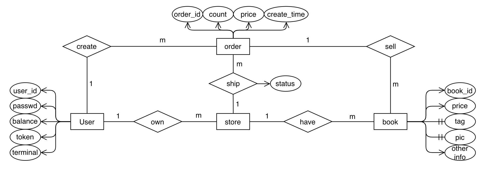

# Bookstore Homework Report Part 2

> Group number: **2**
>
> GitHub Repo Links: [db_homework_work2](https://github.com/walotta/db_bookstore/tree/work2)
>
> By Zhongjing Wei

## Student info

* Name: Zhongjing Wei(韦中敬)

* Student ID: 520030910142
* Class ID: F2003011

## Experimental process

1. Design the ERD and relation table
2. Modify the *mongoDB API* to *sqlalchemy API*
3. Add support of *Transaction processing*
4. Pass the test case and give out report

## Database design

### ERD



ps: in the ERD, `tag` and `pic` is the attributes of book which one book will have several ones.

### Relation & Table design

Details in the statement in `be/model/template/sqlClass/*`, basicly the same as ERD.

## Transaction processing design

Each time the backend receives a request, launch a new session to run a series of actions including query and modify database. If there are some expected error in the processing(e.g. when a user pay for the bill, it cannot afford this fee) or unexpected error(e.g. somehow the program exit) the sql will rollback to the moment before this session start. When the request is finished, commit the session if necessary and close it.

## Added API (40% function API)

### API description

[jump to ship order detail](doc/seller.md#商家发货)

[jump to receive order detail](doc/buyer.md#买家收货)

[jump to query order detail](doc/buyer.md#买家查询订单)

[jump to query order id list detail](doc/buyer.md#买家查询所有订单编号)

[jump to cancel order detail](doc/buyer.md#买家取消订单)

[jump to auto cancel expired order detail](doc/seller.md#自动取消所有超时订单)

[jump to find books with specific requirements](doc/searcher.md#搜索书籍)

### Backend logic implementation

#### ship / receive order

Add a `STATUS` for each order, and update the `STATUS` when the order is shipped or received. We still subtract the stock level when the order is created since the stock level represents all currently available books. When an order is canceled, its stock level is added back.

#### query order (id list)

Directly query through the database.

#### cancel order

To manually cancel, just update the `STATUS` of the order to `CANCELED`. Notice only unpaid orders (thus unshipped, unreceived, and uncanceled) can be canceled.

For auto cancel, we provide an API to auto-remove all expired orders. Expiration time and current time are required by this API. Users are expected to launch a daemon to call this API each `expiration_time`. For example, if `expiration_time` is 1 hour, then the daemon should be launched every 1 hour.

#### search books

Add a searcher for all requirements of searching books with specific needs. This API would give you a list of book names and the stores that sells them. Because there are big differences between finding a book by a single label or finding a book by the contents of the book or by tags, the backend recognizes them as three different situations to process.

We provide an API for diverse search needs. you can search by the book's title, author, content, tags, etc. Users use `dict_name` to assign the label he/she wants to search and use `kind` to choose the specific kind of search he/she needs. Also, in the situation that there are too many return values, the user can use `page_number` to choose the page of information he/she wants to see.

### database operation design

The main reason why documents are designed like this and why setting the index like this is already written in the [table](#Database design).

### Test case design

#### test_order_deliver.py

This test mainly tests the function of order shipping and receiving. One key concern is the status of the order can only change in a specific order: INIT -> PAID -> SHIPPED -> RECEIVED (or INIT -> CANCELED when canceling an order). So we test the status of the order after each operation. We also make sure it correctly error at invalid order.

#### test_order_functions.py

This test mainly tests all new order functions, such as query, cancel, and auto cancel. We test the correctness of the returned value and the status of the order after each operation. We also test the stock level of correctly recouped books after canceling an order.

#### test_search_book.py

This test mainly tests the function of the find_book function. There are three main uses of the function that are tested: search with one label, search with multiple tags, and search with a part of the contents. Each test would combine with some points that are not very fit for input such as dict_name=None, and our function can avoid its harmfulness.

## Test case coverage & Test result

### coverage

| API                        | coverage ratio |
| -------------------------- | -------------- |
| Auth                       | 100%           |
| Buyer                      | 100%           |
| Searcher                   | 78%            |
| Seller                     | 100%           |
| Database interface average | 89%            |
| Total                      | 76%            |

### run result

run with:

```bash
sh script/test.sh
```

result:

```bash
=========================================================== test session starts ============================================================
platform darwin -- Python 3.9.16, pytest-7.2.2, pluggy-1.0.0 -- /Users/wzj/opt/anaconda3/envs/db/bin/python
cachedir: .pytest_cache
rootdir: /Users/wzj/Documents/code/SJTU_DMBS_2023_PJ1
plugins: cov-4.0.0, anyio-3.7.0
collecting ... frontend begin test
 * Serving Flask app 'be.serve' (lazy loading)
 * Environment: production
   WARNING: This is a development server. Do not use it in a production deployment.
   Use a production WSGI server instead.
 * Debug mode: off
2023-06-10 01:24:42,632 [Thread-1    ] [INFO ]   * Running on http://127.0.0.1:5000/ (Press CTRL+C to quit)
collected 45 items                                                                                                                         

fe/test/test_add_book.py::TestAddBook::test_ok PASSED                                                                                [  2%]
fe/test/test_add_book.py::TestAddBook::test_error_non_exist_store_id PASSED                                                          [  4%]
fe/test/test_add_book.py::TestAddBook::test_error_exist_book_id PASSED                                                               [  6%]
fe/test/test_add_book.py::TestAddBook::test_error_non_exist_user_id PASSED                                                           [  8%]
fe/test/test_add_funds.py::TestAddFunds::test_ok PASSED                                                                              [ 11%]
fe/test/test_add_funds.py::TestAddFunds::test_error_user_id PASSED                                                                   [ 13%]
fe/test/test_add_funds.py::TestAddFunds::test_error_password PASSED                                                                  [ 15%]
fe/test/test_add_stock_level.py::TestAddStockLevel::test_error_user_id PASSED                                                        [ 17%]
fe/test/test_add_stock_level.py::TestAddStockLevel::test_error_store_id PASSED                                                       [ 20%]
fe/test/test_add_stock_level.py::TestAddStockLevel::test_error_book_id PASSED                                                        [ 22%]
fe/test/test_add_stock_level.py::TestAddStockLevel::test_ok PASSED                                                                   [ 24%]
fe/test/test_bench.py::test_bench PASSED                                                                                             [ 26%]
fe/test/test_create_store.py::TestCreateStore::test_ok PASSED                                                                        [ 28%]
fe/test/test_create_store.py::TestCreateStore::test_error_exist_store_id PASSED                                                      [ 31%]
fe/test/test_login.py::TestLogin::test_ok PASSED                                                                                     [ 33%]
fe/test/test_login.py::TestLogin::test_error_user_id PASSED                                                                          [ 35%]
fe/test/test_login.py::TestLogin::test_error_password PASSED                                                                         [ 37%]
fe/test/test_new_order.py::TestNewOrder::test_non_exist_book_id PASSED                                                               [ 40%]
fe/test/test_new_order.py::TestNewOrder::test_low_stock_level PASSED                                                                 [ 42%]
fe/test/test_new_order.py::TestNewOrder::test_ok PASSED                                                                              [ 44%]
fe/test/test_new_order.py::TestNewOrder::test_non_exist_user_id PASSED                                                               [ 46%]
fe/test/test_new_order.py::TestNewOrder::test_non_exist_store_id PASSED                                                              [ 48%]
fe/test/test_order_deliver.py::TestOrderDeliver::test_deliver_order PASSED                                                           [ 51%]
fe/test/test_order_deliver.py::TestOrderDeliver::test_deliver_error_status PASSED                                                    [ 53%]
fe/test/test_order_functions.py::TestOrderFunctions::test_query_order PASSED                                                         [ 55%]
fe/test/test_order_functions.py::TestOrderFunctions::test_cancel_order_ok PASSED                                                     [ 57%]
fe/test/test_order_functions.py::TestOrderFunctions::test_cancel_order_error PASSED                                                  [ 60%]
fe/test/test_order_functions.py::TestOrderFunctions::test_auto_cancel_expired_order_ok PASSED                                        [ 62%]
fe/test/test_order_functions.py::TestOrderFunctions::test_cancel_order_recoup_stock_level PASSED                                     [ 64%]
fe/test/test_password.py::TestPassword::test_ok PASSED                                                                               [ 66%]
fe/test/test_password.py::TestPassword::test_error_password PASSED                                                                   [ 68%]
fe/test/test_password.py::TestPassword::test_error_user_id PASSED                                                                    [ 71%]
fe/test/test_payment.py::TestPayment::test_ok PASSED                                                                                 [ 73%]
fe/test/test_payment.py::TestPayment::test_authorization_error PASSED                                                                [ 75%]
fe/test/test_payment.py::TestPayment::test_not_suff_funds PASSED                                                                     [ 77%]
fe/test/test_payment.py::TestPayment::test_repeat_pay PASSED                                                                         [ 80%]
fe/test/test_register.py::TestRegister::test_register_ok PASSED                                                                      [ 82%]
fe/test/test_register.py::TestRegister::test_unregister_ok PASSED                                                                    [ 84%]
fe/test/test_register.py::TestRegister::test_unregister_error_authorization PASSED                                                   [ 86%]
fe/test/test_register.py::TestRegister::test_register_error_exist_user_id PASSED                                                     [ 88%]
fe/test/test_search_book.py::TestSearchBook::test_search_with_title PASSED                                                           [ 91%]
fe/test/test_search_book.py::TestSearchBook::test_search_with_author PASSED                                                          [ 93%]
fe/test/test_search_book.py::TestSearchBook::test_search_with_tags PASSED                                                            [ 95%]
fe/test/test_search_book.py::TestSearchBook::test_search_with_contents PASSED                                                        [ 97%]
fe/test/test_search_book.py::TestSearchBook::test_search_with_author_with_store_id PASSED                                            [100%]

====================================================== 45 passed in 221.74s (0:03:41) ======================================================
/Users/wzj/Documents/code/SJTU_DMBS_2023_PJ1/be/serve.py:19: UserWarning: The 'environ['werkzeug.server.shutdown']' function is deprecated and will be removed in Werkzeug 2.1.
  func()
2023-06-10 01:28:22,090 [Thread-6498 ] [INFO ]  127.0.0.1 - - [10/Jun/2023 01:28:22] "GET /shutdown HTTP/1.1" 200 -
frontend end test
No data to combine
Name                                                     Stmts   Miss Branch BrPart  Cover
------------------------------------------------------------------------------------------
be/__init__.py                                               0      0      0      0   100%
be/app.py                                                    3      3      2      0     0%
be/model/__init__.py                                         0      0      0      0   100%
be/model/buyer.py                                          257     96     94     26    61%
be/model/db/__init__.py                                      0      0      0      0   100%
be/model/db/db_client.py                                    21      1      0      0    95%
be/model/db/interface.py                                    13      0      0      0   100%
be/model/db/sub_interface/__init__.py                        0      0      0      0   100%
be/model/db/sub_interface/new_order_interface.py            43      3     12      1    93%
be/model/db/sub_interface/searcher_interface.py             88     10     36      5    85%
be/model/db/sub_interface/store_interface.py                65      7     16      3    85%
be/model/db/sub_interface/user_interface.py                 72      7     20      7    85%
be/model/error.py                                           29      4      0      0    86%
be/model/searcher.py                                        44      3     12      3    89%
be/model/seller.py                                         146     55     52     10    61%
be/model/template/__init__.py                                0      0      0      0   100%
be/model/template/book_info.py                              16      2      4      1    85%
be/model/template/new_order_template.py                     31      2      4      0    89%
be/model/template/sqlClass/__init__.py                       0      0      0      0   100%
be/model/template/sqlClass/base.py                           4      0      0      0   100%
be/model/template/sqlClass/book_info_pic_sql.py              8      0      0      0   100%
be/model/template/sqlClass/book_info_sql.py                 41      1      0      0    98%
be/model/template/sqlClass/book_info_tags_sql.py             8      0      0      0   100%
be/model/template/sqlClass/order_sql.py                     29      2      0      0    93%
be/model/template/sqlClass/store_book_sql.py                 9      0      0      0   100%
be/model/template/sqlClass/store_sql.py                     15      1      0      0    93%
be/model/template/sqlClass/user_sql.py                      22      1      0      0    95%
be/model/template/store_template.py                         21      3      4      0    80%
be/model/template/user_template.py                          14      1      0      0    93%
be/model/user.py                                           149     41     38      7    70%
be/mongo_model/__init__.py                                   0      0      0      0   100%
be/mongo_model/buyer.py                                    188    188     94      0     0%
be/mongo_model/db/__init__.py                                0      0      0      0   100%
be/mongo_model/db/db_client.py                              34     34      0      0     0%
be/mongo_model/db/interface.py                              12     12      0      0     0%
be/mongo_model/db/sub_interface/__init__.py                  0      0      0      0   100%
be/mongo_model/db/sub_interface/new_order_interface.py      37     37      6      0     0%
be/mongo_model/db/sub_interface/searcher_interface.py       60     60     26      0     0%
be/mongo_model/db/sub_interface/store_interface.py          44     44      6      0     0%
be/mongo_model/db/sub_interface/user_interface.py           47     47      8      0     0%
be/mongo_model/error.py                                     29     29      0      0     0%
be/mongo_model/searcher.py                                  38     38     12      0     0%
be/mongo_model/seller.py                                    98     98     50      0     0%
be/mongo_model/template/__init__.py                          0      0      0      0   100%
be/mongo_model/template/book_info.py                        16     16      4      0     0%
be/mongo_model/template/new_order_template.py               31     31      4      0     0%
be/mongo_model/template/store_template.py                   21     21      4      0     0%
be/mongo_model/template/user_template.py                    14     14      0      0     0%
be/mongo_model/user.py                                     113    113     38      0     0%
be/serve.py                                                 38      1      2      1    95%
be/sql_model/__init__.py                                     0      0      0      0   100%
be/sql_model/buyer.py                                      112    112     48      0     0%
be/sql_model/db_conn.py                                     22     22      6      0     0%
be/sql_model/error.py                                       23     23      0      0     0%
be/sql_model/seller.py                                      50     50     22      0     0%
be/sql_model/store.py                                       29     29      0      0     0%
be/sql_model/user.py                                       119    119     38      0     0%
be/view/__init__.py                                          0      0      0      0   100%
be/view/auth.py                                             42      0      0      0   100%
be/view/buyer.py                                            65      0      2      0   100%
be/view/searcher.py                                         37      7      8      1    78%
be/view/seller.py                                           53      0      0      0   100%
fe/__init__.py                                               0      0      0      0   100%
fe/access/__init__.py                                        0      0      0      0   100%
fe/access/auth.py                                           32      0      0      0   100%
fe/access/book.py                                           72      1     12      2    96%
fe/access/buyer.py                                          63      0      2      0   100%
fe/access/new_buyer.py                                       8      0      0      0   100%
fe/access/new_seller.py                                      8      0      0      0   100%
fe/access/searcher.py                                       13      0      0      0   100%
fe/access/seller.py                                         50      0      0      0   100%
fe/bench/__init__.py                                         0      0      0      0   100%
fe/bench/run.py                                             13      0      6      0   100%
fe/bench/session.py                                         48      0     12      1    98%
fe/bench/workload.py                                       126      1     22      2    98%
fe/conf.py                                                  11      0      0      0   100%
fe/conftest.py                                              25      0      0      0   100%
fe/test/__init__.py                                          0      0      0      0   100%
fe/test/drop_table.py                                       13      1      6      1    89%
fe/test/gen_book_data.py                                    49      0     16      0   100%
fe/test/test_add_book.py                                    36      0     10      0   100%
fe/test/test_add_funds.py                                   23      0      0      0   100%
fe/test/test_add_stock_level.py                             39      0     10      0   100%
fe/test/test_bench.py                                        6      2      0      0    67%
fe/test/test_create_store.py                                20      0      0      0   100%
fe/test/test_login.py                                       28      0      0      0   100%
fe/test/test_new_order.py                                   40      0      0      0   100%
fe/test/test_order_deliver.py                               57      1      4      1    97%
fe/test/test_order_functions.py                            137      3     46      2    97%
fe/test/test_password.py                                    33      0      0      0   100%
fe/test/test_payment.py                                     61      1      4      1    97%
fe/test/test_register.py                                    31      0      0      0   100%
fe/test/test_search_book.py                                171      5     84      4    96%
------------------------------------------------------------------------------------------
TOTAL                                                     3733   1403    906     79    59%
Wrote HTML report to htmlcov/index.html
```


